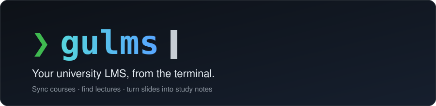
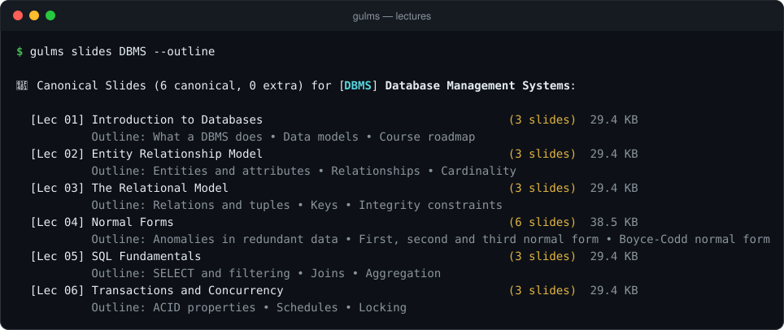
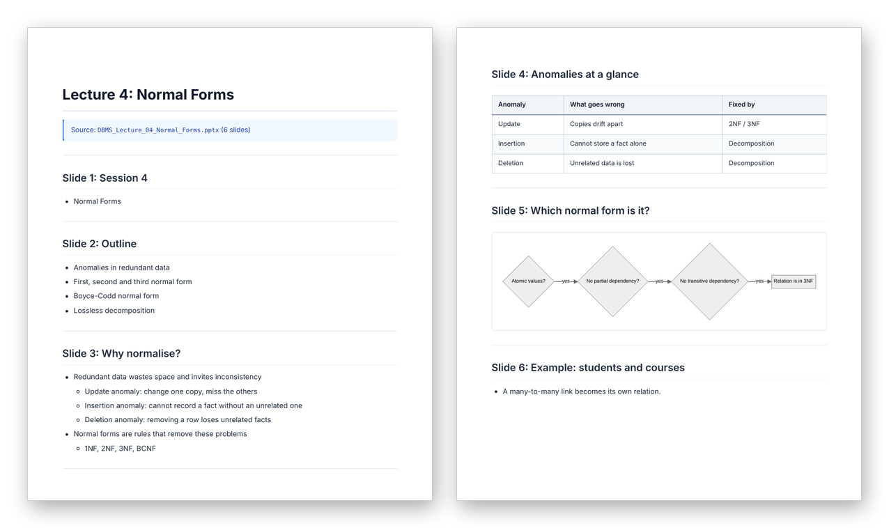
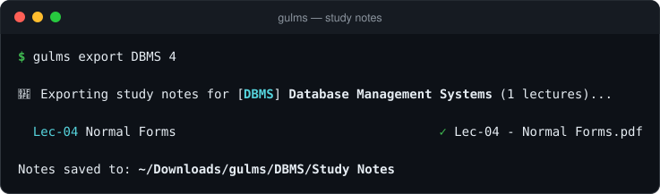
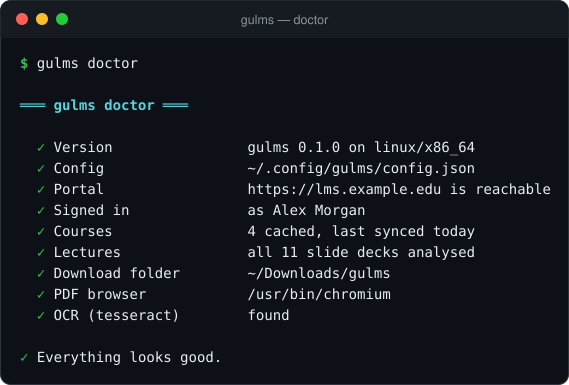

<p align="center">
  
</p>

<p align="center">
  <a href="https://github.com/omsingh02/gulms/actions/workflows/ci.yml"></a>
  <a href="https://github.com/omsingh02/gulms/releases/latest"></a>
  
  
  
</p>

<p align="center">
  <b>Sync your courses, find any lecture in seconds, and turn slide decks into clean study notes.</b><br>
  One small, fast binary. No browser tabs, no hunting through <code>L3_final_v2 (1).pptx</code>.
</p>

<p align="center">
  
</p>

## Why gulms

- **Lectures, not file piles.** It reads your slide decks to learn each lecture's number, title and agenda, and folds the near-duplicate uploads into one clean list.
- **Study notes in one command.** `gulms export DBMS 4` turns a deck into Markdown and a PDF with nested bullets, tables, figures and flowcharts. University template banners and repeated footers are stripped out.
- **Fast and incremental.** Syncing only fetches courses that changed. Everything is cached, so browsing is instant and works offline.
- **Friendly.** Guided first-run setup, interactive menus with search, tab completion, and `gulms doctor` for when something is off.
- **Private by design.** Your password is never stored, there's no telemetry, and the login token is saved readable only by you. [Details below.](#privacy-and-security)

> **Unofficial.** gulms is an independent project. It is not affiliated with or endorsed by Galgotias University or Moodle. It is built for Galgotias University's portal; other Moodle sites with the mobile web service enabled should work too (`gulms login --url https://your.moodle.site`) but have not been tested.

## Install

<details open>
<summary><b>macOS and Linux</b></summary>

```sh
curl -fsSL https://raw.githubusercontent.com/omsingh02/gulms/main/install.sh | sh
```

Installs to `~/.local/bin` after verifying a SHA-256 checksum. Pick a version with `GULMS_VERSION=v0.1.0`, or a folder with `GULMS_INSTALL_DIR`.
</details>

<details open>
<summary><b>Windows (PowerShell)</b></summary>

```powershell
irm https://raw.githubusercontent.com/omsingh02/gulms/main/install.ps1 | iex
```

Installs to `%LOCALAPPDATA%\Programs\gulms`, adds it to your `PATH`, and verifies a checksum.
</details>

<details>
<summary><b>Prebuilt binaries</b></summary>

Download the archive for your platform from the [latest release](https://github.com/omsingh02/gulms/releases/latest), check it against `SHA256SUMS`, and put `gulms` somewhere on your `PATH`. Builds are published for Linux (x86-64, ARM64), macOS (Intel, Apple silicon) and Windows (x86-64).

On macOS, if a browser-downloaded binary is blocked as "from an unidentified developer", run `xattr -d com.apple.quarantine gulms` (the install script avoids this).
</details>

<details>
<summary><b>From source</b></summary>

You need a [Rust toolchain](https://rustup.rs) (1.88 or newer).

```sh
cargo install --git https://github.com/omsingh02/gulms
```
</details>

## Quick start

```sh
gulms
```

The first run walks you through setup: sign in with your LMS username and password, pick the courses to track, and choose a download folder. After that, `gulms` opens an interactive menu.

```sh
gulms slides DBMS            # lectures with titles and slide counts
gulms export DBMS 4 --open   # study notes for lecture 4, then open the PDF
gulms search "normal forms"  # find a file across every course
gulms download-course DBMS   # one copy of each lecture, named properly
```

Courses can be given by their short code (`DBMS`), name, or their number in `gulms courses`. Enable tab completion with `gulms completions bash|zsh|fish|powershell`.

## Study notes

<p align="center">
  
</p>

`gulms export` reads each slide's text, tables, pictures and diagrams and writes `<downloads>/<COURSE>/Study Notes/Lec-04 - Normal Forms.md` plus a matching PDF with a clickable outline. Arrows drawn between boxes become real flowcharts.

<p align="center">
  
</p>

| Optional tool | What it adds | Without it |
| :--- | :--- | :--- |
| Chrome, Chromium, Edge or Brave | the PDF (found automatically, or set `CHROME_BIN`) | you still get the Markdown |
| `tesseract` | reads text inside screenshots and figures | image text is skipped |
| Internet while exporting | draws flowcharts using a pinned, integrity-checked copy of [Mermaid](https://mermaid.js.org) | flowcharts appear as text |

How lectures are recognised: `gulms analyze` (which `slides`, `export` and `download-course` offer to run) downloads each deck once, reads it, and caches the lecture number, title and agenda. After that the duplicate uploads of a lecture collapse into the fullest version.

## Commands

| Command | What it does |
| :--- | :--- |
| `gulms` | interactive menu (first run: guided setup) |
| `setup` · `login` · `logout` · `whoami` | account and first-run setup |
| `sync [--force]` | fetch courses and materials (only what changed) |
| `courses` · `select` | list courses · choose which to track |
| `slides COURSE [-o] [-a]` | lectures with titles and slide counts · `-o` agendas · `-a` every upload |
| `analyze [COURSE]` | read slide decks so lectures can be numbered and titled |
| `export COURSE [N] [--no-pdf] [--open]` | study notes for one lecture or all of them |
| `view COURSE [--by-section]` · `notes COURSE` | browse a course's files |
| `search QUERY [-c COURSE] [-d]` · `recent [--days N]` | find files · see what's new |
| `download QUERY` · `open QUERY` · `download-course COURSE` | get files |
| `doctor` · `completions SHELL` | diagnose problems · shell completion script |

Run `gulms --help` or `gulms COMMAND --help` for every option. Commands exit non-zero on failure, so they work in scripts, and `NO_COLOR=1` turns colors off.

### Something not working?

<p align="center">
  
</p>

`gulms doctor` checks your sign-in, the portal, your folders and the optional tools, and tells you exactly what to run to fix each problem.

<details>
<summary><b>Common questions</b></summary>

- **`gulms: command not found`.** The install folder isn't on your `PATH`. The installer prints the line to add; on Windows, open a new terminal.
- **"Your session has expired."** Run `gulms login`.
- **No PDF was produced.** Install Chrome, Chromium or Edge (or set `CHROME_BIN`), or use `--no-pdf` to keep just the Markdown.
- **Lectures show up as "Extra" or unnumbered.** Run `gulms analyze`.
- **Where are my files?** `gulms whoami` shows every path. Downloads go to `<download folder>/<COURSE>/<category>/`.
- **Windows SmartScreen warns about the download.** The binaries aren't code-signed yet; verify the checksum from the release page if you're unsure.
</details>

## Privacy and security

- Your **password is sent only to your portal's login endpoint**, once, to get an access token. It is never written to disk or logs.
- The **token** is stored in `config.json` readable only by you (`0600` on Linux and macOS). `gulms logout` removes it; to revoke it on the portal itself, use *Preferences → Security keys*.
- **No telemetry, no analytics, no update pings.** gulms talks to your portal. The only other request is fetching Mermaid from jsDelivr (pinned version, verified with an integrity hash) when a PDF contains a flowchart. The installers talk to GitHub.
- Install scripts verify a SHA-256 checksum before installing anything.

To report a vulnerability, please use [private reporting](https://github.com/omsingh02/gulms/security/advisories/new). See [SECURITY.md](SECURITY.md).

## Files and configuration

| What | Linux | macOS | Windows |
| :--- | :--- | :--- | :--- |
| Config (`config.json`) | `~/.config/gulms` | `~/Library/Application Support/gulms` | `%APPDATA%\gulms` |
| Cache (courses, lecture data) | `~/.cache/gulms` | `~/Library/Caches/gulms` | `%LOCALAPPDATA%\gulms` |
| Downloads | `~/Downloads/gulms` | `~/Downloads/gulms` | `Downloads\gulms` |

Override the locations with `GULMS_CONFIG_DIR` and `GULMS_CACHE_DIR`. Optional `config.json` keys you can edit by hand: `download_dir` (where files go), `viewer` (command used to open PDFs), `base_url` (portal address).

For scripts, sign in without a prompt: `printf '%s\n' "$LMS_PASSWORD" | gulms login --username YOUR_ADMISSION_NUMBER --password-stdin`. Passing the password as an argument is deliberately unsupported.

## Platform support

The test suite, lints and installers run in CI on **Linux, macOS and Windows**, and release binaries are built natively on each. The interactive menus have seen the most use on Linux; if something looks off on another platform, please [open an issue](https://github.com/omsingh02/gulms/issues/new/choose) with the output of `gulms doctor`.

## Contributing

Bug reports, ideas and pull requests are welcome; start with [CONTRIBUTING.md](CONTRIBUTING.md). The end-to-end tests run the real binary against a fake portal, so you can work without touching a real account:

```sh
cargo test && cargo clippy --all-targets -- -D warnings && cargo fmt --check
```

<details>
<summary><b>Coming from the old Python version?</b></summary>

That version was retired and lives on in git history; everything it did is in this binary. The notable changes: the old `gulms notes COURSE` (slides to study notes) is now `gulms export COURSE`, notes go to `<downloads>/<COURSE>/Study Notes/`, and the Python library API was removed. Your existing `config.json` and cache keep working. See the [changelog](CHANGELOG.md) for the full list.
</details>

## License

Licensed under either of [Apache License, Version 2.0](LICENSE-APACHE) or [MIT license](LICENSE-MIT) at your option. Unless you explicitly state otherwise, any contribution you intentionally submit for inclusion in this project, as defined in the Apache-2.0 license, shall be dual licensed as above, without any additional terms or conditions.
